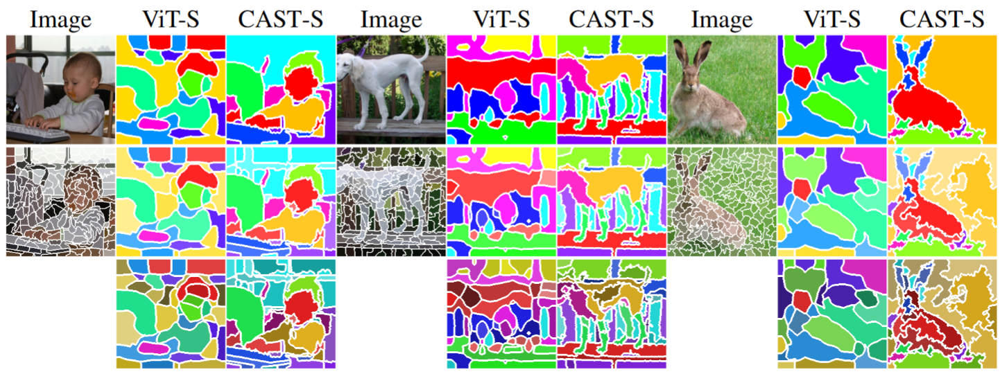

# Learning Hierarchical Image Segmentation For Recognition and By Recognition
By [Tsung-Wei Ke*](https://twke18.github.io/), [Sangwoo Mo*](https://sites.google.com/view/sangwoomo) and [Stella X. Yu](https://web.eecs.umich.edu/~stellayu/)

Official implementation of ["Learning Hierarchical Image Segmentation For Recognition and By Recognition"](https://openreview.net/forum?id=IRcv4yFX6z).  This work is selected as a spotlight paper in ICLR 2024.

<div class="column">

</div>

Image segmentation and recognition occur simultaneously, with recognition relying on the underlying segmentation to form a continuous visual grouping hierarchy. For example, the same object can be parsed into different part-to-whole structures, resulting in varying recognitions. Despite this, most prior works treated segmentation and recognition as separate tasks. In this paper, we aim to devise a learning framework that involves segmentation in the recognition process, utilizing hierarchical segmentation for recognition, which is learned by recognition. Specifically, we propose CAST, which realizes this concept through designs inspired by vision transformers, enabling concurrent segmentation and recognition with a single model. The core idea of CAST is to employ adaptive segment tokens that group the finest pixels into coarser segments, using the latest embedding to represent the entire image for recognition. Trained solely on image recognition objectives, CAST automatically discovers the hierarchy of segments. Our experiments demonstrate that CAST provides consistent hierarchical segmentation and recognition, which is impossible with state-of-the-art segmentation methods such as SAM. Additionally, CAST offers several advantages over the standard ViT, including improved semantic segmentation, computational efficiency, and object-centric attention.


### Hierarchical segmentation derived from image-based self-supervised learning

<div class="column">

</div>


## Installation

Create a conda environment with the following command:
```
# initiate conda env
> conda update conda
> conda env create -f environment.yaml
> conda activate cast

# install dgl (https://www.dgl.ai/pages/start.html)
> pip install dgl==1.1.3+cu116 -f https://data.dgl.ai/wheels/cu116/dgl-1.1.3%2Bcu116-cp38-cp38-manylinux1_x86_64.whl
```

## Model overview and stand-alone usage

To facilitate fast development on top of our model, we provide here an [overview](docs/OVERVIEW.md) of our implementation of CAST.

The model can be indenpendently installed and used as a stand-alone package.
```
> pip install -e .
# import the model
> from cast_models.cast import cast_small
> model = cast_small()
```

## Data Preparation

See [Preparing datasets](docs/DATASETS.md).

## Getting Started

### Representation pre-training / Image classification

See [Getting started with self-supervised learning of CAST](docs/GETTING_STARTED_SELF.md)

See [Getting started with fully-supervised learning of CAST](docs/GETTING_STARTED_FULL.md)

### Fine-tuning on Semantic segmentation

See [Getting started with fine-tuning of CAST on Pascal Context and ADE20K](docs/GETTING_STARTED_ADE_CONTEXT.md)

See [Getting started with unsupervised segementation and fine-tuning of CAST on VOC](docs/GETTING_STARTED_VOC.md)

### Part segmentation on PartImageNet

See [Getting started with part segmentation of CAST on PartImageNet](docs/GETTING_STARTED_PartImageNet.md)


### Visualize hierarchical segmentation

See our [jupyter notebook](notebooks/visualize_hierarchical_segmentation.ipynb)


## Model zoo

We host the model weights on hugging face.

1. Self-supervised trained models on ImageNet-1K.  We use a smaller batch size (256) and shorter training epochs (100) compared to the original setup of MoCo-v3.

|| Acc. | pre-trained weights |
|:--------:|:--------:|:--------:|
| ViT-S  | 67.9 | [link](https://huggingface.co/twke/CAST/blob/main/snapshots/moco/imagenet1k/vit_small/checkpoint_0099.pth.tar) |
| CAST-S | 68.1 | [link](https://huggingface.co/twke/CAST/blob/main/snapshots/moco/imagenet1k/cast_small/checkpoint_0099.pth.tar) |
| CAST-SD | 69.1 | [link](https://huggingface.co/twke/CAST/blob/main/snapshots/moco/imagenet1k/cast_small_deep/checkpoint_0099.pth.tar) |
| ViT-B | 72.5 | [link](https://huggingface.co/twke/CAST/blob/main/snapshots/moco/imagenet1k/vit_base/checkpoint_0099.pth.tar) |
| CAST-B | 72.4 | [link](https://huggingface.co/twke/CAST/blob/main/snapshots/moco/imagenet1k/cast_base/checkpoint_0099.pth.tar) |

2. Self-supervised trained models on COCO.  We evaluate sementic segmentation before and after fine-tuning on Pascal VOC.

| CAST-S | mIoU | pre-trained weights |
|:--------:|:--------:|:--------:|
|  before fine-tuning | 38.4 | [link](https://huggingface.co/twke/CAST/blob/main/snapshots/moco/coco/cast_small/checkpoint_0149.pth.tar) |
|  after fine-tuning | 67.6| [link](https://huggingface.co/twke/CAST/blob/main/snapshots/moco/coco/cast_small/checkpoint_0399.pth.tar) |

We pre-train CAST for 400 epochs on COCO.  Segmentation before fine-tuning on VOC uses the checkpoint at the 149th epoch.  Segmentation after fine-tuning on VOC uses the final checkpoint.

3. Supervised trained models on ImageNet-1K.  We evaluate semantic segmentaiton by fine-tuning on ADE20K and Pascal Context.

|| ImageNet-1K (Acc.) | ADE20K (mIoU) | Pascal Context (mIoU) | pre-trained weights |
|:--------:|:--------:|:--------:|:--------:|:--------:|
| CAST-S | 80.4 | 43.1 | 49.1 | [link](https://huggingface.co/twke/CAST/blob/main/snapshots/deit/imagenet1k/cast_small/best_checkpoint.pth) |


We also provide a compressed [zip file](https://huggingface.co/twke/CAST/blob/main/snapshots.zip), which include most of the trained model weights, except those fine-tuned on ADE20K and Pascal Context.

## Citation
If you find this code useful for your research, please consider citing our paper "Learning Hierarchical Image Segmentation For Recognition and By Recognition".

```
@inproceedings{ke2023cast,
  title={Learning Hierarchical Image Segmentation For Recognition and By Recognition},
  author={Ke, Tsung-Wei and Mo, Sangwoo and Stella, X Yu},
  booktitle={The Twelfth International Conference on Learning Representations},
  year={2023}
}
```

## License
CAST is released under the MIT License (refer to the LICENSE file for details).

## Acknowledgement
This release of code is based on [MOCO-v3](https://github.com/facebookresearch/moco-v3), [DeiT](https://github.com/facebookresearch/deit), [SegFormer](https://github.com/NVlabs/SegFormer), [SPML](https://github.com/twke18/SPML).
