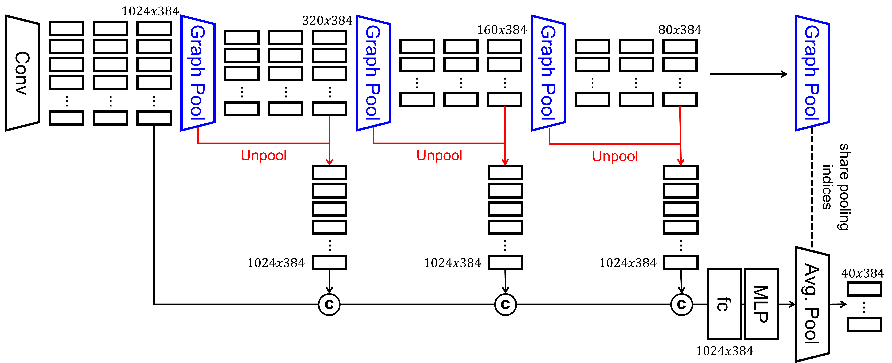
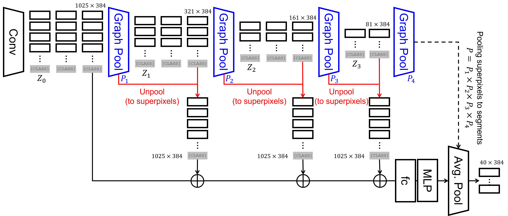

# Getting started with self-supervised learning of CAST
There are two architectural variants of CAST proposed in the paper.  One is for image-classification and another is for segmentation.  Both architectures can be pre-trained using self-supervised learning.  In the paper, we used [MoCo-v3](https://github.com/facebookresearch/moco-v3) framework for all self-supervised learning experiments.

We provide the bashscripts for running self-supervised experiments.  By default, we use `CAST-S`.  You can use larger models, e.g. `CAST-B` by replacing `-a cast_small` with `-a cast_base` in the bashscripts.

### Model architecture

<div class="column">
<p>(a) CAST for classification</p>

</div>

<div class="column">
<p>(b) CAST for segmentation</p>

</div>

### Pre-train on ImageNet for classification

1. Self-supervised learning of CAST on ImageNet-1K:
```
> bash scripts/moco/train_imagenet1k_cast.sh
```

2. Self-supervised learning of CAST on ImageNet-100:
```
> bash scripts/moco/train_imagenet100_cast.sh
```

3. Self-supervised learning of ViT on ImageNet-1K:
```
> bash scripts/moco/train_imagenet1k.sh
```

4. Self-supervised learning of ViT on ImageNet-100:
```
> bash scripts/moco/train_imagenet100.sh
```

5. In the paper, we ablate the efficacy of our `Graph Pooling` module by replacing it with the [`Token Merging` module](https://arxiv.org/abs/2210.09461).  Both models use `superpixel` tokens.  Run the following bashscript to reproduce our ablation study of `Token Merging` module on ImageNet-100:
```
> bash scripts/moco/train_imagenet100_tome.sh
```

### Pre-train on COCO for segmentation

1. Self-supervised learning of CAST on COCO:
```
> bash scripts/moco/train_coco_cast.sh
```